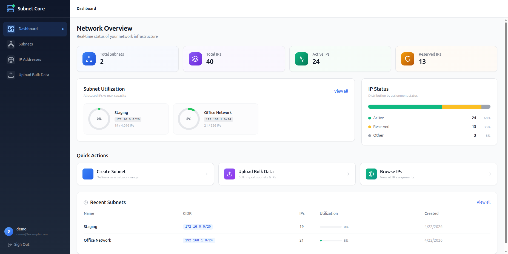
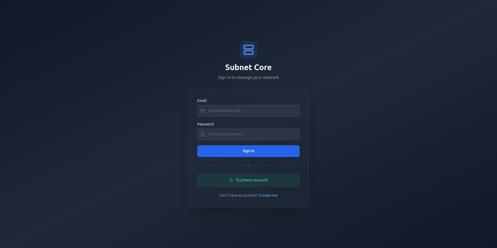
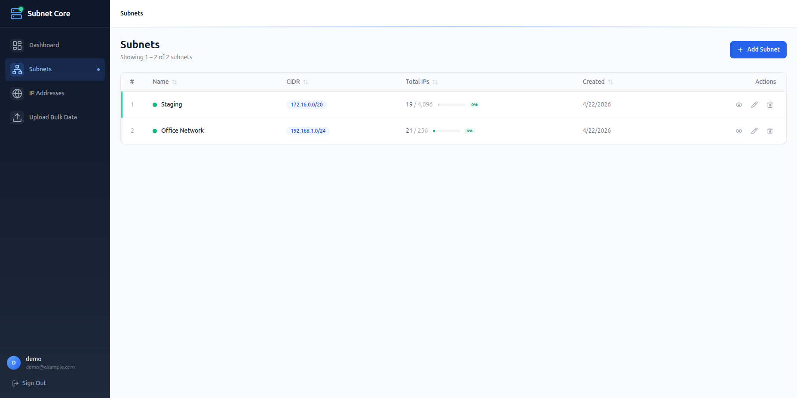
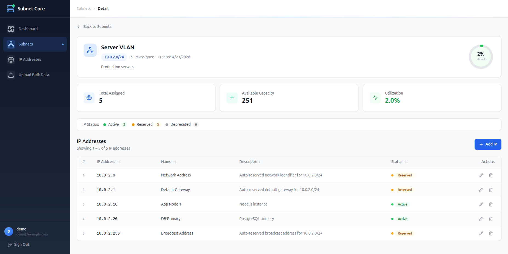
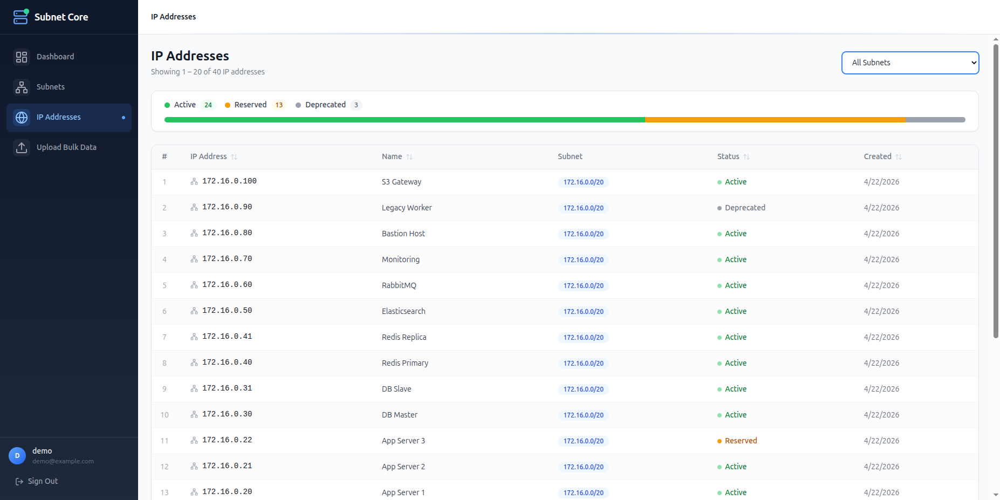
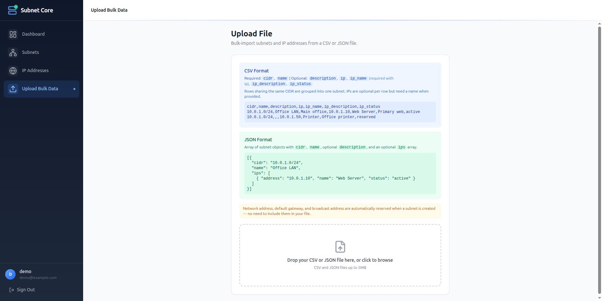

# Subnet Core

Full-stack IPAM (IP Address Management) application built with NestJS, React, PostgreSQL, and Docker.




## Quick Start

```bash
docker compose up --build
```

| Service | URL / Port | Description |
|---------------|---------------------------|----------------------------------------|
| **Frontend** | http://localhost | React SPA |
| **Backend** | http://localhost:3000 | REST API (Swagger at `/api/docs`) |
| **PostgreSQL**| port 5432 | Database |
| **pgweb** | http://localhost:8081 | Web-based DB browser |
| **Seed** | one-shot container | Creates demo user + sample data |

**Demo login:** `demo@example.com` / `password123` — or click **"Try Demo Account"** on the login page.


## Features

- JWT authentication with refresh tokens and a one-click demo login
- Subnet CRUD with CIDR validation, utilization tracking, and capacity charts
- IP address management with per-subnet CIDR range validation and status tracking (active / reserved / deprecated)
- Automatic reservation of network, gateway, and broadcast addresses on subnet creation
- Bulk CSV & JSON import with row-level validation (samples in [`samples/`](samples/))
- Server-side sorting, pagination, and audit trail on all entities
- Built-in [pgweb](http://localhost:8081) database viewer

## Screenshots

**Login** — JWT auth with a one-click demo account



**Subnets** — sortable list with utilization bars and inline actions



**Subnet Detail** — capacity stats, IP status breakdown, and per-IP management



**IP Addresses** — global view with status distribution bar and subnet filter



**Bulk Upload** — add CSV/JSON import with inline format reference



## Tech Stack

| Layer | Technology |
|----------|---------------------------------------------------------------|
| Backend | NestJS 10, TypeORM, Passport JWT, class-validator |
| Frontend | React 18, Vite, TanStack Query v5, React Hook Form, Zod |
| Database | PostgreSQL 16 with UUID primary keys |
| Infra | Docker, Docker Compose, Nginx, pgweb |

## API

All endpoints are prefixed with `/api`. Full Swagger docs at `localhost:3000/api/docs`.

<details>
<summary>Authentication</summary>

| Method | Endpoint | Auth | Description |
|--------|----------------------|------|--------------------------|
| POST | /api/auth/register | No | Register |
| POST | /api/auth/login | No | Login |
| POST | /api/auth/refresh | Yes | Refresh access token |
| POST | /api/auth/logout | Yes | Invalidate refresh token |

</details>

<details>
<summary>Subnets</summary>

| Method | Endpoint | Auth | Description |
|--------|---------------------|------|----------------------------------------|
| GET | /api/subnets | Yes | List (paginated, sortable) |
| GET | /api/subnets/:id | Yes | Get by ID |
| POST | /api/subnets | Yes | Create (auto-reserves infra IPs) |
| PUT | /api/subnets/:id | Yes | Update |
| DELETE | /api/subnets/:id | Yes | Delete subnet and its IPs |

</details>

<details>
<summary>IP Addresses</summary>

| Method | Endpoint | Auth | Description |
|--------|--------------------------------|------|--------------------------------|
| GET | /api/ips | Yes | List (paginated, sortable) |
| GET | /api/ips/:id | Yes | Get by ID |
| POST | /api/subnets/:subnetId/ips | Yes | Create IP in subnet |
| PUT | /api/subnets/:subnetId/ips/:id | Yes | Update metadata |
| DELETE | /api/subnets/:subnetId/ips/:id | Yes | Delete |

IPs are validated against the parent subnet's CIDR on creation. The address is immutable after creation.

</details>

<details>
<summary>File Upload</summary>

| Method | Endpoint | Auth | Description |
|--------|------------------|------|--------------------------------------|
| POST | /api/upload | Yes | Upload CSV or JSON (auto-detected) |
| POST | /api/upload/csv | Yes | Upload CSV |
| POST | /api/upload/json | Yes | Upload JSON |

Accepts `multipart/form-data` with a `file` field (max 5 MB).

</details>

<details>
<summary>Pagination & Sorting</summary>

All list endpoints support `page`, `limit`, `sortBy`, and `sortOrder` query parameters.

</details>

## Infrastructure IP Reservation

When a subnet is created, three addresses are auto-reserved:

| Reserved IP | Purpose | Example (`192.168.1.0/24`) |
|---------------------|-------------------------------|----------------------------|
| Network Address | Identifies the subnet | `192.168.1.0` |
| Default Gateway | First usable address (router) | `192.168.1.1` |
| Broadcast Address | Broadcast to all hosts | `192.168.1.255` |

Edge cases: **/32** and **/31** subnets skip reservation (all addresses are usable per RFC 3021).

## Import Formats

Sample files: [`samples/sample.csv`](samples/sample.csv), [`samples/sample.json`](samples/sample.json)

**CSV** — rows sharing the same `cidr` are grouped into one subnet:

```csv
cidr,name,description,ip,ip_name,ip_description,ip_status
10.0.1.0/24,Office LAN,Main office,10.0.1.10,Web Server,Primary web,active
10.0.1.0/24,,,10.0.1.50,Printer,Office printer,reserved
```

**JSON** — array of subnet objects with optional `ips`:

```json
[
  {
    "cidr": "10.0.1.0/24",
    "name": "Office LAN",
    "ips": [
      { "address": "10.0.1.10", "name": "Web Server", "status": "active" }
    ]
  }
]
```

## Database Setup & Migrations

The schema is managed through **TypeORM migrations** — `synchronize` is disabled in all environments.

### With the NestJS environment (recommended)

```bash
cd backend

# Generate a new migration after changing entities
npm run migration:generate -- src/database/migrations/MigrationName

# Apply pending migrations
npm run migration:run

# Revert the last migration
npm run migration:revert

# Show migration status
npm run migration:show
```

Migrations are auto-discovered from `src/database/migrations/` and executed in timestamp order.

### Without NestJS (raw SQL)

For manual provisioning or CI pipelines that don't use Node.js:

```bash
psql -U postgres -d subnet_core -f database/init.sql
```

This standalone script creates all tables, indexes, and foreign keys identical to the TypeORM migration.

### PostgreSQL version

The project targets **PostgreSQL 16** (Alpine image). The `uuid-ossp` extension is required and is created automatically by the migration.

## Design Decisions

1. **Clean Architecture** — Controllers → Services → Repositories, each independently testable.
2. **Repository Pattern** — Wraps TypeORM to decouple business logic from the ORM.
3. **Factory + Strategy for Parsing** — `ParserFactory` selects a `FileParserStrategy` by MIME type. Adding formats (XML, YAML) requires only a new strategy class.
4. **Auto Infrastructure IP Reservation** — Mirrors real-world IPAM behavior; prevents accidental assignment of non-host addresses.
5. **CIDR-Validated Manual IP Management** — IPs are validated against the parent subnet at creation and immutable afterward.
6. **Audit Trail** — `createdById` / `updatedById` extracted from JWT on every write.
7. **Server-side Sort with Column Whitelist** — Prevents SQL injection via `ORDER BY`.
8. **JWT + Refresh Tokens** — 15-min access tokens + 7-day refresh tokens, bcrypt-hashed in DB.

## Trade-offs & Future Work

- In-memory file parsing — streaming would be better for very large files
- Single-process seed container — migrations with seed hooks would be more robust

### Future Improvements

- [ ] CSV/JSON export
- [ ] Subnet overlap detection
- [ ] Redis caching
- [ ] YAML and XML import strategies
